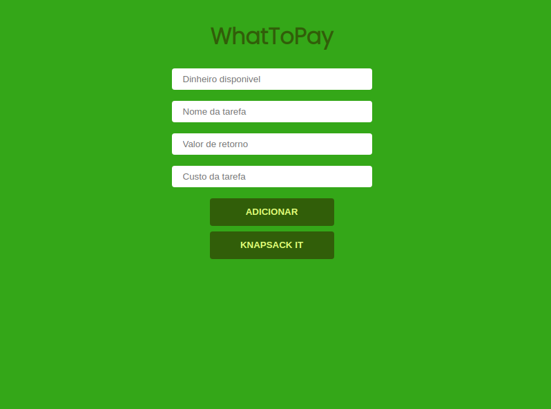
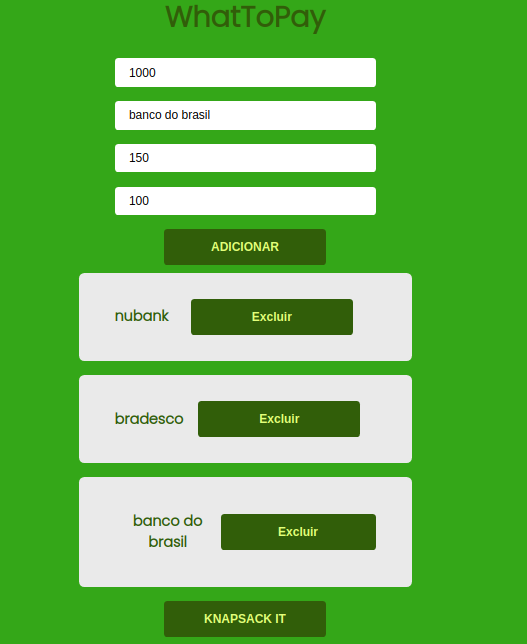

# WhatPay

**Número da Lista**: 5
**Conteúdo da Disciplina**: DP (Programação Dinâminca)

## Alunos
|Matrícula | Aluno |
| -- | -- |
| 18/0033743  |  João Pedro Silva de Carvalho |
| 18/0028324  |  Thiago Luiz de Souza Gomes |

## Sobre 
É uma calculadora de priorização de investimentos e gastos, onde indica qual a melhor ordem para as suas despesas baseada no algoritmo de Knapsack interativo.

## Screenshots

 

 

 

## Instalação 
**Linguagem**: JavaScript

Necessita do Node.js versão 12 ou maior.

## Uso 

Na raiz do repositório apenas digite:

~~~Shell
npm install

npm start
~~~

